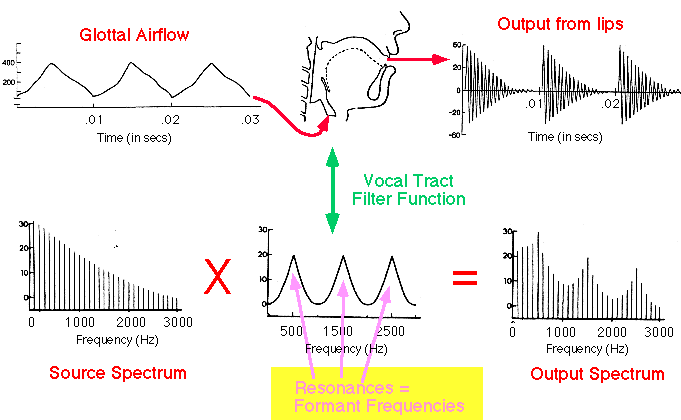
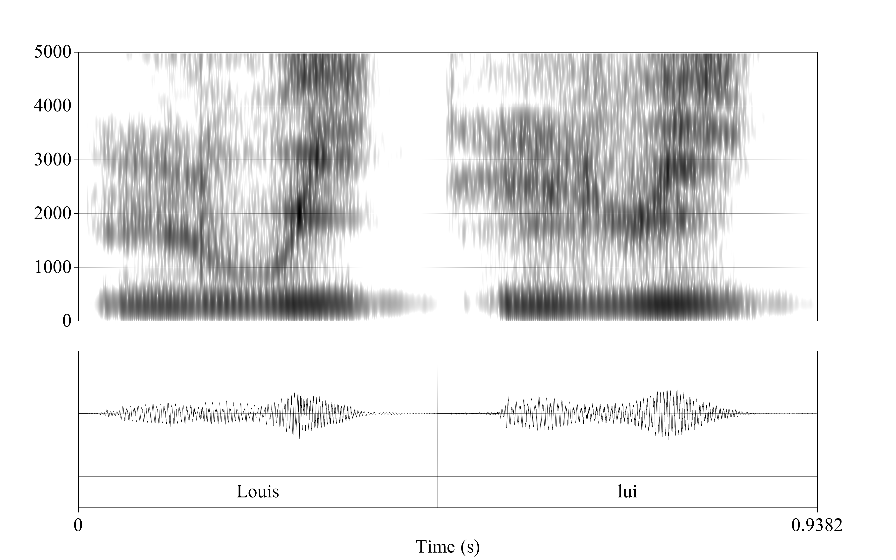
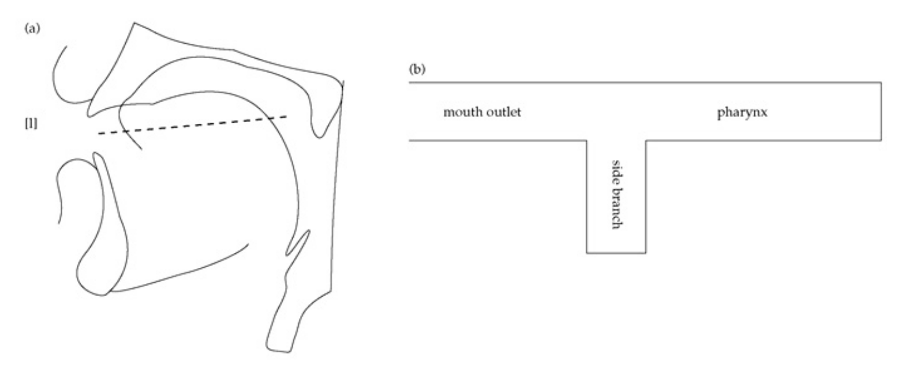

```{r setup, include=FALSE}
knitr::opts_chunk$set(echo = FALSE, warning = FALSE, message = FALSE, dev='cairo_pdf', comment=NA)
# setwd("/home/agricolamz/work/materials/2020_HSE_m_Instrumental_phonetics/docs/lec 3")
library(tidyverse)
library(extrafont)
loadfonts()
theme_set(theme_bw()+
            theme(text = element_text(size = 19, family = "Brill")))
```

# Earlier: 

* Source-filter model



# Earlier: 

* Tube model


# Earlier: 

* Tube model


# Earlier: 

* Tube model


# Earlier: 

* Source-filter model
* Tube model

Movements and positions of the articulators are shaping the resonating cavities of the vocal tract to modify the sound source for **resonant/sonorant** consonants as well:

* approximants/glides/semivowels (ʋ, w, j, ɰ, ɥ,  \alert{/ɹ/?}),
* nasals (m, ɱ, n, ɲ, ŋ, ɴ ...),
* liquids l (lateral) and various /r/ (rhotics:
\alert{approximants} & vibrants = trill + tap / flap).

# Semivowels

* The vocal tract is relatively open for the semivowels, as it is for vowels.
* So, the semivowels are characterized acoustically by formants.

## But they are consonantsǃ

Occur on the periphery of syllables, and not in the centers or nuclei of syllables:

* Russian *дай* [daj] 'give' vs. English *die* [daɪ]
* English *yo-yo* ['jəʊjəʊ] vs. Russian *йо-йо* [jo'ʝo]

But:

* Russian *театр* [tʲi'atr] vs [tʲi'atr̥]/[tʲi'atər] 'theatre'
* English *button* ['bʌtn]
* Mande languages ŋ 'I'

# Semivowels: ʋ, w, j, ɥ, ɰ

Since articulation of those vowels is really similar to corresponding vowel the spectrum will be simmilar:

* ʋ, w --- u
* j --- i
* ɰ --- ɨ
* ɥ --- y

# Semivowels: w, ɥ

French *Louis* [lwi] 'Louis' vs. *lui* [lɥi] 'him'



# Semivowels: ɹ, ɻ

Those semivowels are produced by raising the tongue toward the alveolar ridge, the tip does not touch the alveolar ridge. The acoustic results of these tongue tip adjustments are particularly obvious in the third formant: F3 falls below the F3 frequencies typical of the neighboring vowels.


# Nasal Stops

The greater surface area of the vocal tract means that the walls of the vocal tract absorb more energy than in non-nasal sounds, and the greater volume of air means that the inertia of air within the vocal tract absorbs more sound as well.

# Nasal Stops: uvular ɴ


# Nasal Stops: uvular ɴ

When the uvula is lowered and the dorsum of the tongue raised to produce an uvular nasal, the vocal tract can be described as a uniform tube that is closed at the glottis and open at the nostrils.If we know the length of the tube, we can calculate its resonant frequencies, because this is a quarter-wave resonator (like the vocal tract configuration for schwa).

[@fant1960]:  12.5 cm (the distance from the uvula to the nares) + 9 cm (the distance from the uvula to the glottis) ≈ 21.5 cm

* F1 = c/4L = 35000/4*21.5 = 407 Hz
* F2 = 3c/4L = 1221 Hz
* F3 = 5c/4L = 2035 Hz
* F4 = 7c/4L = 2849 Hz

Since there is a velocity maximum at the nostrils each of the resonant frequencies will be lower. It is hard to make quantitative predictions about the formant frequencies of ɴ (the shape of the nasal passage varies), but the formant values will be spaced more closely in the
uvular nasal than they are in ǝ

# Nasal Stops: ɴ


# Nasal Stops: m


# Nasal Stops: anti-resonance

The main difference between ɴ and m is that the mouth cavity forms a side branch in the resonant tube. The mouth cavity can be modeled as a tube closed at one end (the lips) and open at the other (the uvula) , with a length of about 9 cm. We can therefore calculate the resonances of the mouth cavity as we did for ǝ, ɴ:

* c/4L = 35,000 / (4 × 9) = 972
* 3c/4L = 2,917 Hz

The resonant frequencies of the mouth cavity in nasals are not like that we’ve seen before: the mouth cavity is a side branch of a larger resonantor: it doesn’t open directly to the atmosphere. They are "absorbed" in the side branch **anti-resonance** the frequency components in m that are near the resonant frequencies of the mouth cavity are canceled, and become \alert{anti-resonances} (anti-formants) in the acoustic output. **Formants** show up in the spectrum as **peaks** of sound energy, and **anti-formants** show up as pronounced spectral **valleys**.

# Nasal Stops: the main properties

* low F1 (sometimes called the “nasal formant”),
* close spacing between formants,
* the presence of anti-formants, whose frequencies are determined by the place of articulation

# Laterals



Laterals could be analised in the similar way: a small pocket of air on top of the tongue acts as a  4cm side branch (to the main acoustic channel which curves around one or both sides of the tongue) produce anti-formants in the spectrum (≈ 2,125).

# Nasal, nasalised, and prenasalised vowels

The most complicated configuration of the vocal tract: 2 resonant systems
at once:

* the pharynx cavity + the mouth cavity --- the oral tract – has resonances at about 500 Hz, 1,500 Hz, and 2,500 Hz;
* the pharynx cavity + the nasal cavity --- the nasal tract – 400, 1,200, 2,000 Hz.

All these formants are present in the spectrum of **nasal vowels**. Of course, the resonant frequencies of the oral tract can be modified by movements of the tongue and lips, constriction of the nose at the nares.

For **nasalised/prenasalised vowels** closed mouth produced antiformants (680 Hz, 2040 Hz).

# References {.allowframebreaks}

